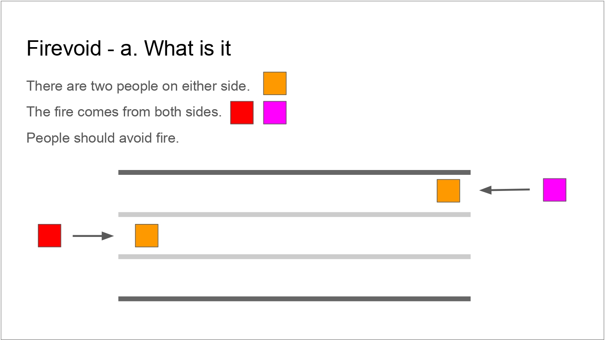
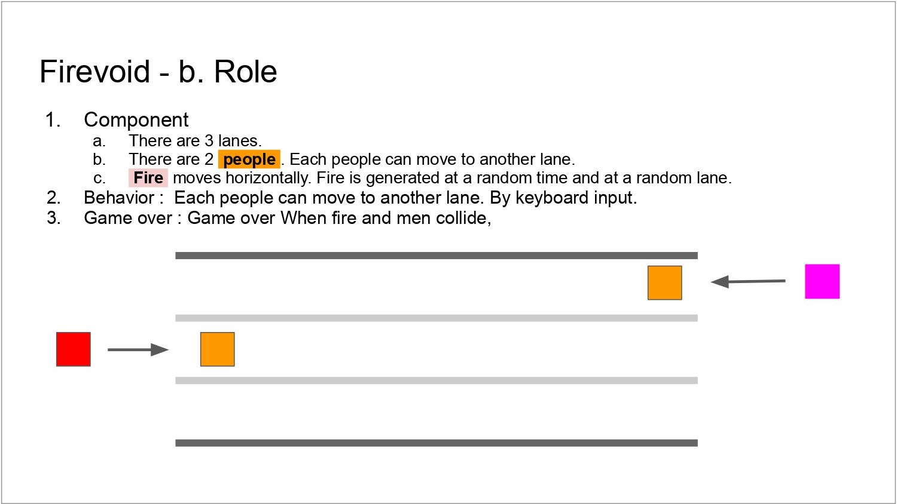
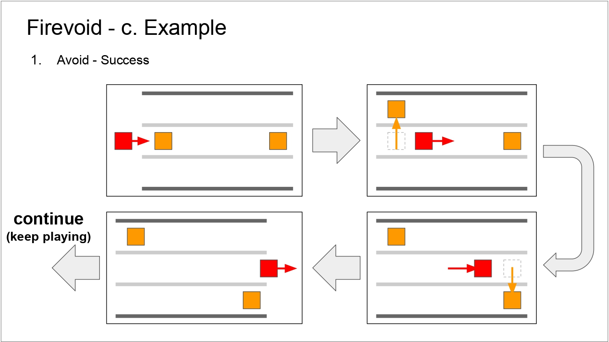

# firevoid

## [Play now](https://wonjinyi.github.io/firevoid)

Web Minigame (Sejong Univ. Web Programming - A part of Group Project)

## Idea Note

## Resources

#### BGM

- On Fire by Robin Hustin [from NCS](https://ncs.io/OnFire)

#### SFX

- Arcade video game explosion [from mixkit.co](https://mixkit.co/free-sound-effects/crash/)
- Arcade fast game over [from mixkit.co](https://mixkit.co/free-sound-effects/game-over/)
- Winning chimes [from mixkit.co](https://mixkit.co/free-sound-effects/win/)
