# Firevoid

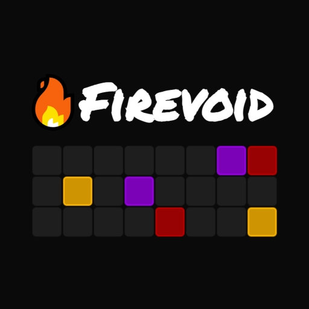

### Play Firevoid

[Click to Play](https://wonjinyi.github.io/firevoid)

### What is this

It is Web Minigame. (Sejong Univ. Web Programming Group Project)

### Components

There are 2 Type of blocks

- **person** : yellow
- **fire** : red, purple

### Rule

- Gameover : Person should avoid fire blocks. When person collides with fire, player will lose 1 💖. If player loses all 💖, it is gameover.
- Get score : If a fire block goes out of the game board, player gets 1 score.
- Stage up : Whenever player gets 10 score, player moves on to the next stage. The higher the stage, the faster the block movement.

### Resources

##### BGM

- On Fire by Robin Hustin [from NCS](https://ncs.io/OnFire)

##### SFX

- Arcade video game explosion [from mixkit.co](https://mixkit.co/free-sound-effects/crash/)
- Arcade fast game over [from mixkit.co](https://mixkit.co/free-sound-effects/game-over/)
- Winning chimes [from mixkit.co](https://mixkit.co/free-sound-effects/win/)

## Idea Note And Simple Report

Google Presentation [Link](https://docs.google.com/presentation/d/1BSQOfw5ZjulpScQxDMcZRYsDlyMiVe5bwuVMyYaVRyY/edit?usp=sharing)

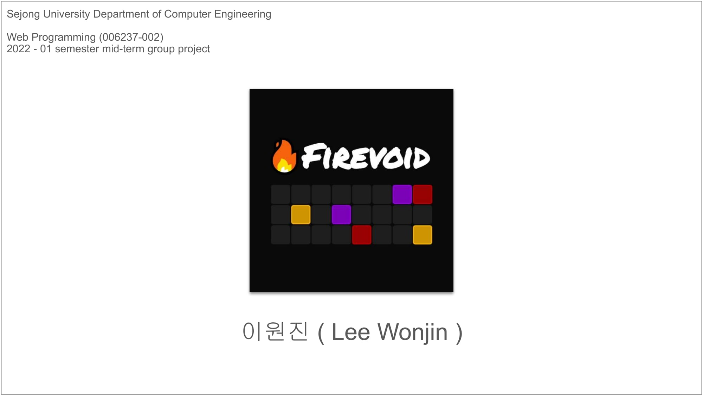
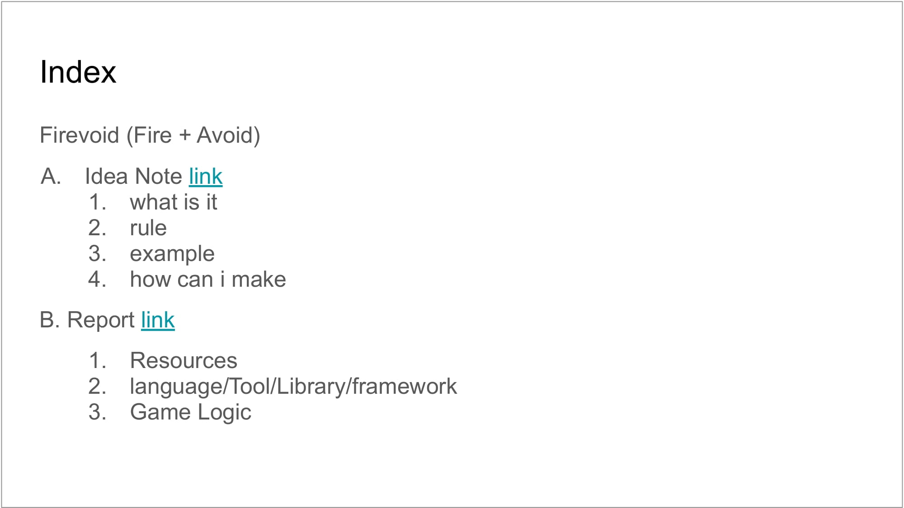

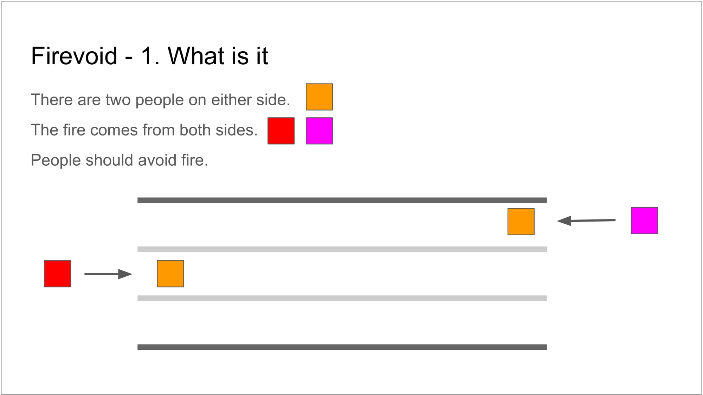
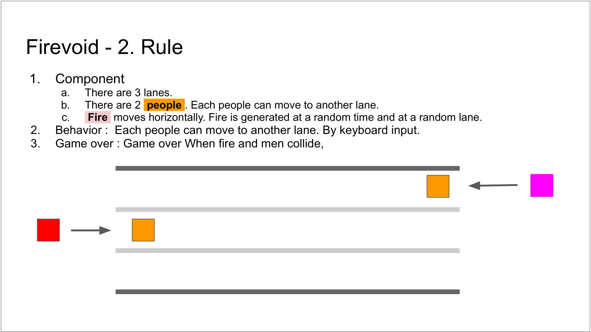

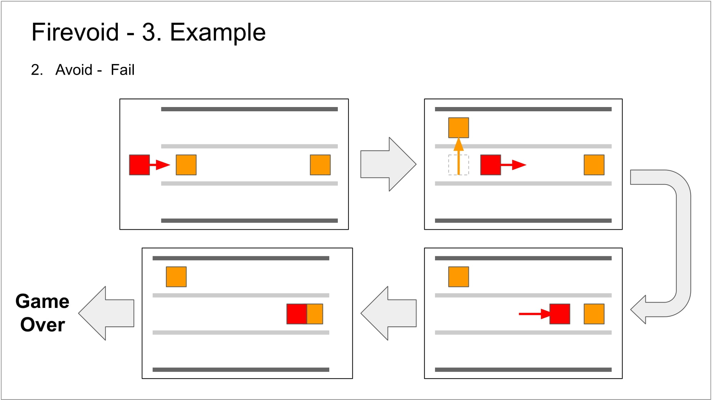
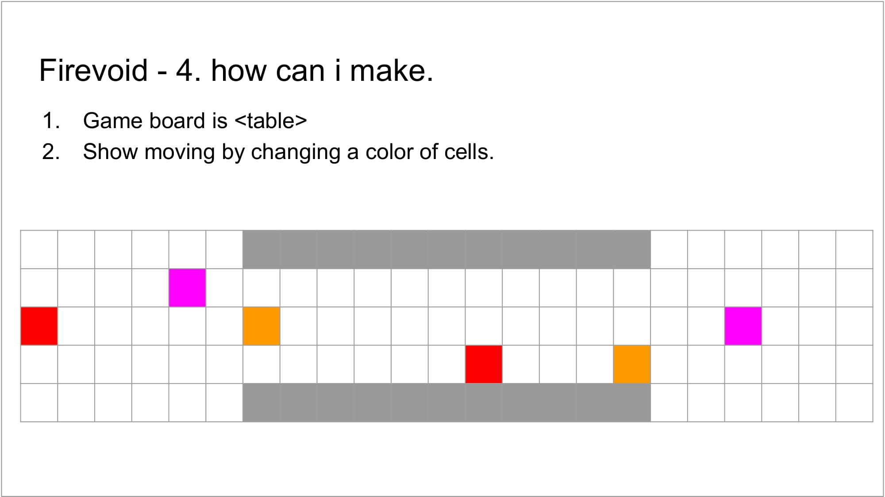
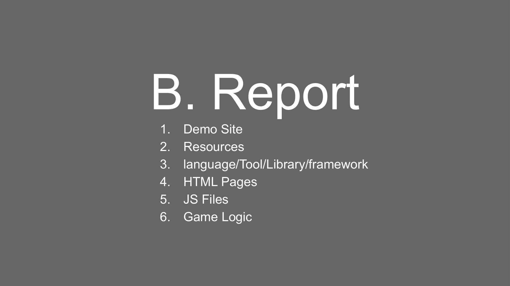
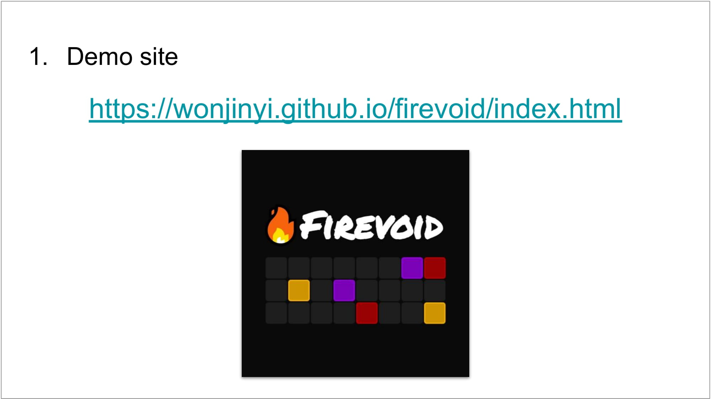
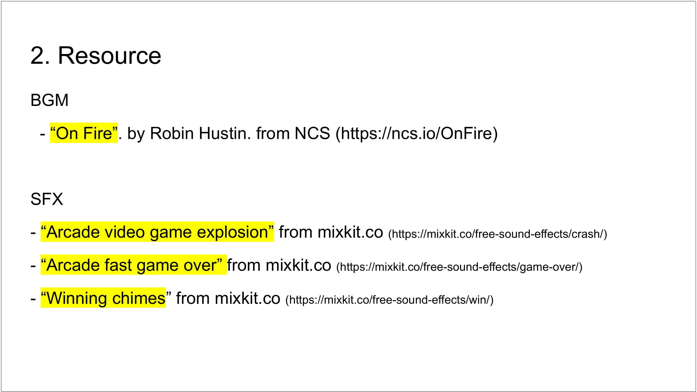
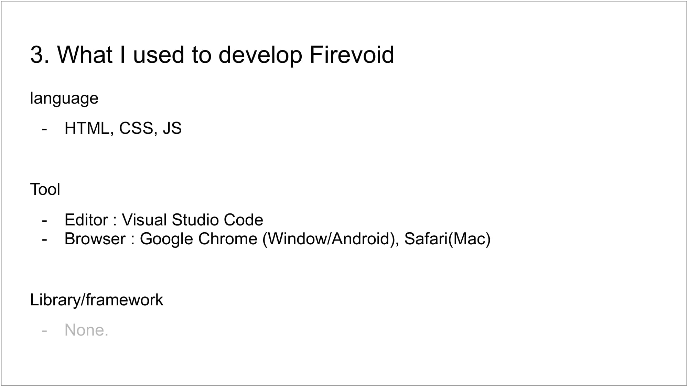
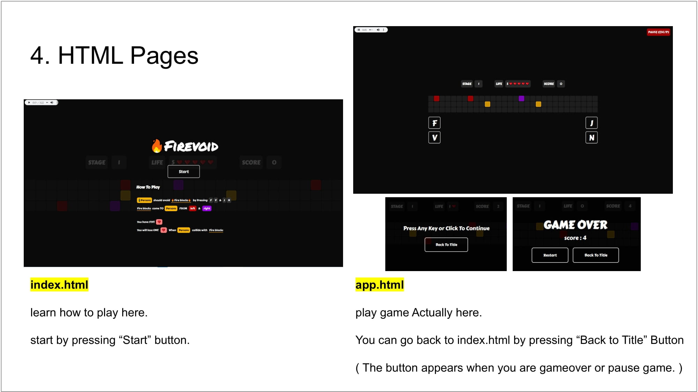
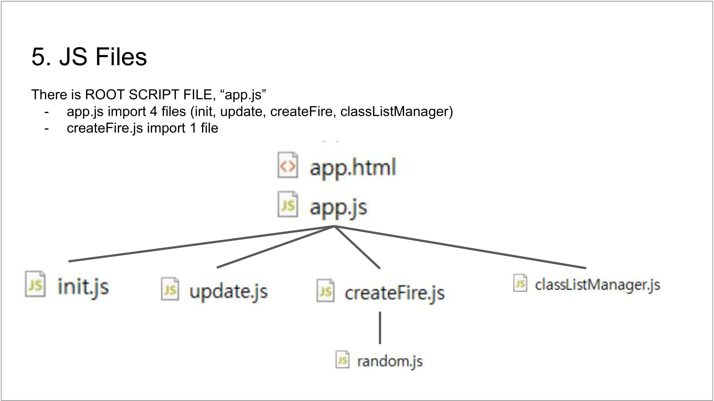
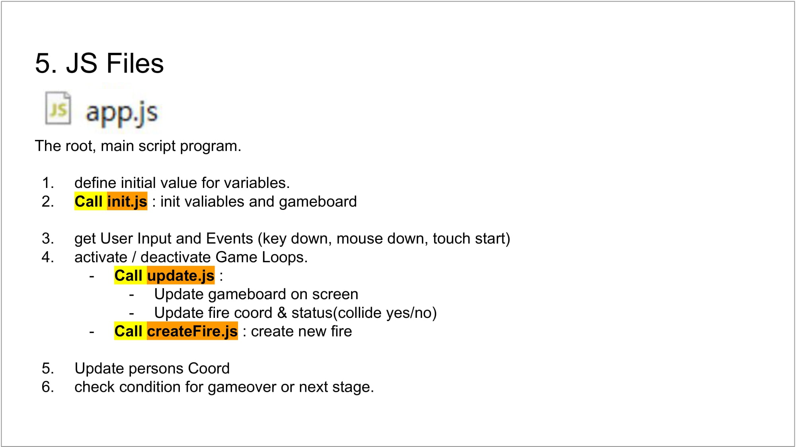
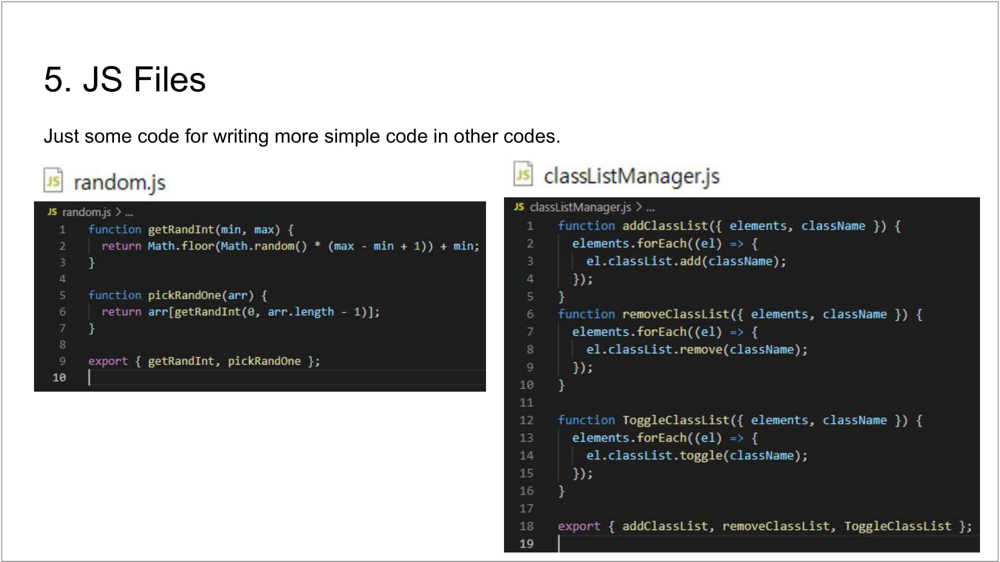
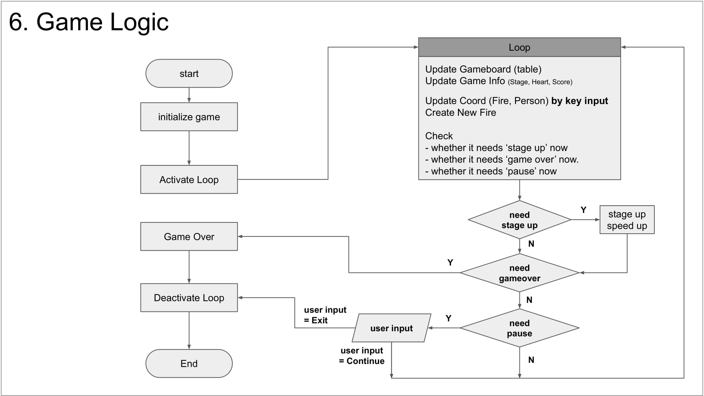
